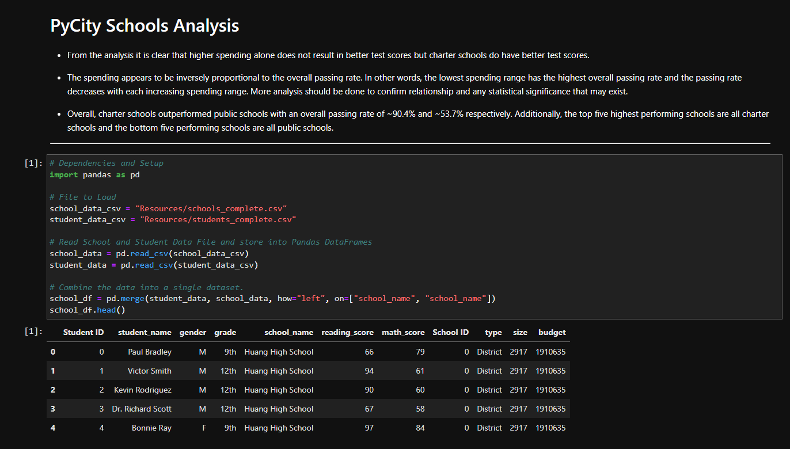

# PyCity Schools Analysis

## A Python analysis of school standardized test results

*Juypter Notebook is inside of the PyCitySchools directory*  
*Data used is inside of the PyCitySchools\Resources directory*

### Directory structure
PyCitySchools/  
├─ PyCitySchools.ipynb  
├─ Resources/  
│  ├─ schools_complete.csv  
│  ├─ students_complete.csv

